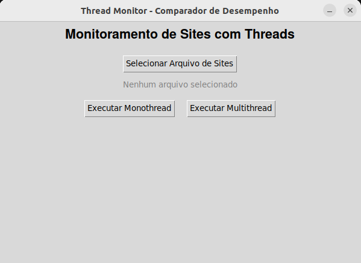
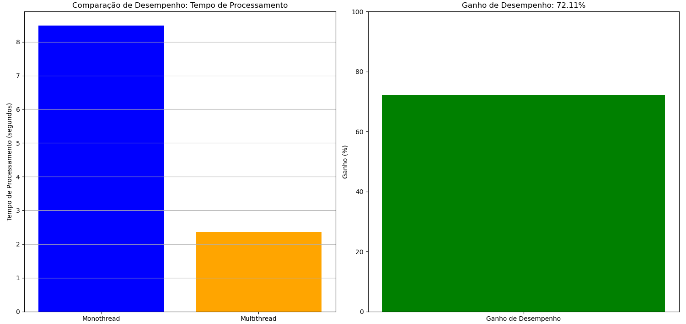
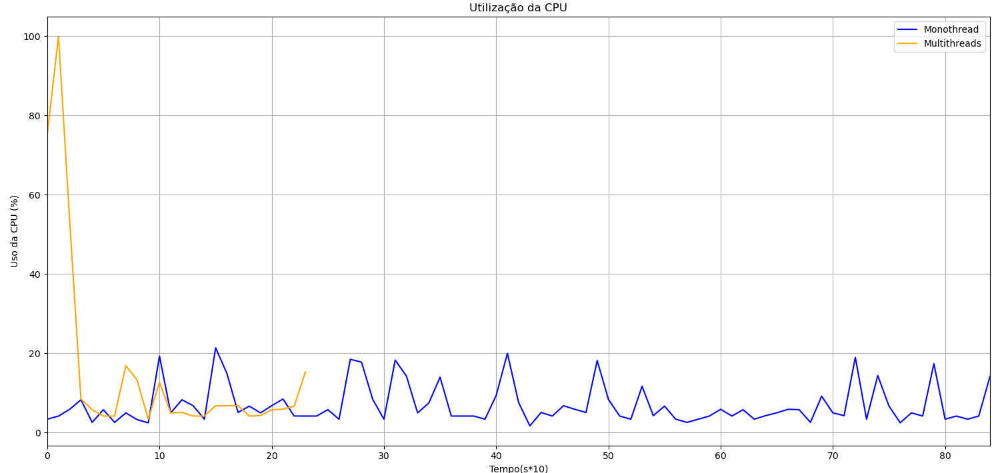
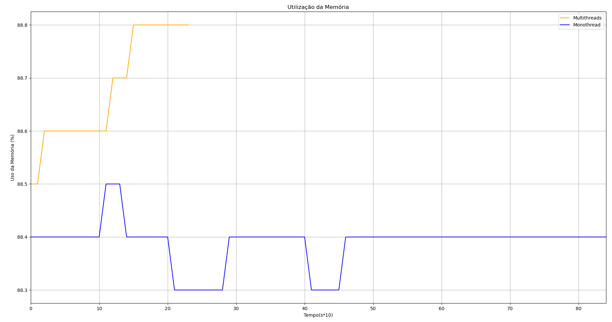

# 🧵 Monitoramento de Sites Utilizando Threads em Python

Este repositório apresenta os benefícios do uso de **Threads** em comparação com uma abordagem **sequencial** tradicional, por meio de uma aplicação Python que monitora o status de uma lista de sites.

A aplicação oferece duas abordagens para o monitoramento:
- **Monothread** (sequencial)
- **Multithread** (paralela)

Ao final da execução, são exibidos **gráficos comparativos** de tempo de execução, uso da CPU e consumo de memória RAM, permitindo uma análise de desempenho entre as abordagens.

---

## 🗂️ Estrutura do Projeto
```bash
  site_monitoring/
  ├── site_monitoring/
  │ ├── gui.py # Interface gráfica (Tkinter)
  │ ├── verification.py # Lógica de verificação mono e multithread
  │ ├── plot.py # Geração dos gráficos comparativos
  │ └── monitor.py # Função de monitoramento dos sites
  ├── main.py # Ponto de entrada da aplicação
  └── sites.txt # Exemplo de arquivo com URLs
```  

---

## 🖥️ Funcionalidades

- Interface gráfica desenvolvida com **Tkinter**
- Upload de arquivos `.txt` com a lista de sites a serem verificados
- Execução do monitoramento via **Monothread** ou **Multithread**
- Comparação visual de:
  - ⏱️ Tempo de execução
  - 💻 Uso da CPU
  - 🧠 Consumo de Memória RAM

---

## 🖼️ Interface Gráfica

 <p align="center">
  
</p>

A interface permite:
- Selecionar o arquivo com os sites
- Executar o monitoramento em modo monothread ou multithread
- Visualizar os gráficos gerados com os dados comparativos

---

## 📊 Resultados e Comparações

### ⏱️ Tempo de Execução

A abordagem multithread realiza a verificação dos sites de forma concorrente, ou seja, várias requisições são enviadas ao mesmo tempo utilizando múltiplas threads. Isso reduz drasticamente o tempo total de execução, já que o programa não precisa aguardar o término de uma requisição para iniciar a próxima. Em vez disso, o tempo final tende a ser determinado pelo site com a maior latência, tornando a operação muito mais eficiente para listas longas de URLs.

Na execução monothread (sequencial), cada site é verificado um de cada vez, e o tempo total é equivalente à soma dos tempos de resposta individuais. Isso gera um gargalo evidente, especialmente quando há sites com tempo de resposta alto ou instável.

 <p align="center">
  
</p>

--- 

### 💻 Consumo da CPU

Durante a execução monothread, a CPU permanece por longos períodos em estado de espera (I/O blocking), aguardando a resposta de cada site antes de prosseguir. Isso resulta em uma baixa utilização do processador, visto que a maior parte do tempo o programa está ocioso, esperando o retorno das chamadas de rede.

Por outro lado, a abordagem multithread é capaz de explorar melhor a capacidade da CPU, mantendo-a ativa com múltiplas threads que gerenciam as requisições de forma paralela. Cada thread atua de forma independente, e enquanto uma aguarda a resposta de um site, outras continuam processando normalmente.


 <p align="center">
  
</p>

---

### 🧠 Consumo de Memória RAM

O modelo multithread, por sua natureza, aloca mais estruturas simultâneas em memória: cada thread possui seu próprio contexto de execução, incluindo pilha, variáveis locais e buffers temporários de rede. Por isso, é esperado que haja um aumento no consumo de memória RAM quando comparado à versão sequencial.

Já no modo monothread, como apenas uma tarefa é processada por vez, o uso de memória permanece baixo e constante ao longo da execução.

 <p align="center">
  
</p>

---

## 📦 Bibliotecas Utilizadas

- `matplotlib` – Geração de gráficos
- `time` – Medição de tempo
- `psutil` – Monitoramento de uso de CPU e RAM
- `concurrent.futures.ThreadPoolExecutor` – Execução paralela
- `requests` – Requisições HTTP
- `threading` – Manipulação de threads
- `tkinter` – Criação da interface gráfica

---

## 🚀 Como Executar

1. Clone o repositório:
   ```bash
   git clone https://github.com/seu-usuario/threads-sites-monitor.git
   cd threads-sites-monitor
   ```
2. Instale as dependências:
   ```bash
   pip install -r requirements.txt
   ```
3. Execute o projeto:
   ```bash
   python main.py
   ```
